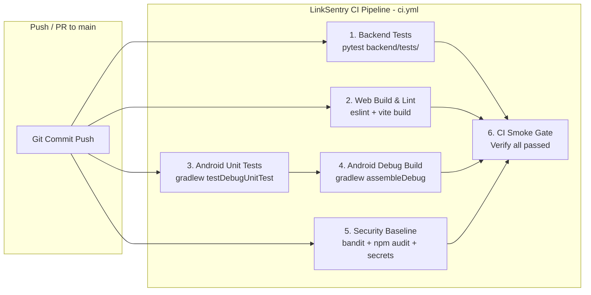

# LinkSentry CI/CD Pipeline Documentation

## 1. Overview & Architecture

LinkSentry uses GitHub Actions for continuous integration, automated testing, security scanning, and production build verification across its multi-platform ecosystem:
- **Backend**: FastAPI + scikit-learn + LinearSVC V3.3 Threat Engine (Python 3.11)
- **Web Frontend**: React 19 + Vite + ESLint (Node.js 20)
- **Android Native**: Kotlin + Jetpack Compose (Java 17 / Android SDK)
- **Security & SAST**: Bandit AST Scanner + npm audit + Secret Pattern Detection

---

## 2. Pipeline Jobs & Matrix

| Job Identifier | Runner | Prerequisites | Key Steps | Output Artifacts |
| :--- | :--- | :--- | :--- | :--- |
| `backend-tests` | `ubuntu-latest` | Python 3.11 | `pip install -r backend/requirements.txt`, `pytest backend/tests/ -v --junitxml` | `pytest-results.xml` (14-day retention) |
| `web-build` | `ubuntu-latest` | Node.js 20 | `npm ci`, `npm run lint` (ESLint), `npm run build` (Vite) | `dist/` production assets |
| `android-unit-tests` | `ubuntu-latest` | Java 17 (Temurin) | `gradle/actions/setup-gradle@v3`, `./gradlew testDebugUnitTest` | Unit test HTML/XML reports |
| `android-build` | `ubuntu-latest` | Java 17, Android SDK | `./gradlew assembleDebug --no-daemon` | `app-debug.apk` |
| `security-scan` | `ubuntu-latest` | Python 3.11, Node 20 | `bandit -r backend -ll`, `npm audit --audit-level=high`, Secret scan | `bandit-report.txt` |
| `firestore-rules-tests` | `ubuntu-latest` | Node.js 20, Java 17 | `npx firebase-tools emulators:exec "node --test tests-firestore/..."` | Emulator test results |
| `ci-smoke` | `ubuntu-latest` | All upstream jobs | Validates complete release gate integrity | Status confirmation |

---

## 3. Dedicated Auxiliary Workflows

### 3.1 Security & Vulnerability Scanning (`.github/workflows/security.yml`)
- **Triggers**: Push, Pull Request, Weekly schedule (`0 4 * * 1`), Manual `workflow_dispatch`.
- **Purpose**: Deep AST vulnerability analysis via Bandit, high-severity npm audit, and strict private key regex scanning.

### 3.2 Automated E2E Regression (`.github/workflows/selenium-e2e.yml`)
- **Triggers**: Nightly schedule (`0 2 * * *`), Manual `workflow_dispatch`.
- **Purpose**: 23+ (expanding to 100+) Selenium scenarios against deployed test instances with Mochawesome and failure screenshot capture.

### 3.3 Performance & Load Testing (`.github/workflows/load-test.yml`)
- **Triggers**: Weekly schedule (`0 0 * * 0`), Manual `workflow_dispatch`.
- **Purpose**: k6 load and stress testing measuring p95/p99 latency against configurable target base URLs.

---

## 4. Security & Environment Principles

1. **Least-Privilege Permissions**: All workflows explicitly declare `permissions: contents: read`.
2. **Zero Hardcoded Secrets**: Workflows never echo, expose, or require developer personal `.env` files.
3. **Hermetic Testing**: Unit and build jobs run self-contained without requiring live production Firebase or database connections.
4. **Low-RAM Compatibility**: Android builds in CI use `--no-daemon` and conservative worker pools, matching local developer memory requirements (7–8 GB RAM).
