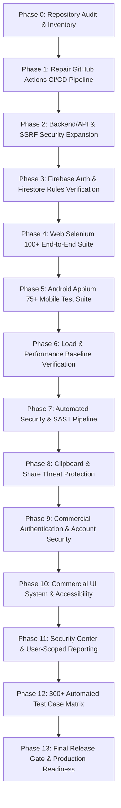

# LinkSentry Master QA & Production Readiness Master Plan

## 1. Executive Summary & Verification Objective

LinkSentry is a multi-platform cybersecurity threat intelligence and scanning solution comprising:
1. **React 19 + Vite Web Application**
2. **Kotlin + Jetpack Compose Android Native Application**
3. **FastAPI Threat Detection Microservice**
4. **LinkSentry V3.3 ML + Rule-Fusion URL & Smishing Engine**
5. **Firebase Authentication (Unified Multi-Platform Identity)**
6. **Cloud Firestore Multi-Tenant Audit Trail (`users/{uid}/scans/{scanId}`)**

This Master QA & Security Verification Plan establishes a rigorous, production-grade quality assurance, security validation, and automated CI/CD pipeline targeting **300+ meaningful, automated test cases** across all platform tiers.

---

## 2. Phase 0 Test Inventory & Baseline Audit

### 2.1 Actual Test Inventory Count (Discovered & Executed)

| Test Suite / Area | Framework | Test File(s) | Actual Discovered Count | Execution Status |
| :--- | :--- | :--- | :--- | :--- |
| **Backend API Hardening** | Pytest / FastAPI TestClient | `backend/tests/test_api_hardening.py` | 12 | **12 / 12 PASS** |
| **Backend URL Detector** | Pytest | `backend/tests/test_detector.py` | 14 | **14 / 14 PASS** |
| **Backend Message Detector** | Pytest | `backend/tests/test_message_detector.py` | 20 | **20 / 20 PASS** |
| **Backend Multi-Signal Engine** | Pytest | `backend/tests/test_multi_signal_message.py` | 5 | **5 / 5 PASS** |
| **Cross-Platform Sync & Isolation** | Pytest / Live HTTP & Firestore Model | `tests/test_cross_platform_sync.py` | 4 | **4 / 4 PASS** |
| **Android Unit Tests** | JUnit4 / Gson | `android/app/src/test/java/...` | 12 | **12 / 12 PASS** |
| **Web Selenium E2E** | Mocha / Chai / Selenium WebDriver | `e2e/tests/01_auth.test.js` - `07_dashboard.test.js` | 23 | 23 Implemented |
| **Android Appium Mobile** | Mocha / Chai / WebdriverIO Appium | `e2e-mobile/tests/android_functional_flows.test.js` | 14 (Placeholders) | 0 Real / 14 Planned |
| **API Performance & Load** | Grafana k6 | `loadtest/scenarios/*.test.js` | 3 scenarios | 3 Implemented |
| **Firestore Security Rules** | Rules Definition | `firestore.rules` | Static rules | Automated tests missing |
| **Security Scanning** | Bandit / npm audit | Local scan | 1 (npm audit) | 0 Vulnerabilities |

**Total Real Automated Tests Currently Passing**: **77 tests** (65 Pytest + 12 Android Unit).

---

## 3. Test Coverage & Gap Analysis Matrix

| Area | Existing | Missing | Planned (Target) |
| :--- | :--- | :--- | :--- |
| **Backend / API / Security Engine** | 65 tests | SSRF defenses, private IP rebinding, Unicode/punycode abuse, malformed JSON, rate limit enforcement, header injection, CORS edge cases | **>= 100 tests** |
| **Firebase Auth & Firestore Security** | Static rules (`firestore.rules`) | `@firebase/rules-unit-testing` emulator suite, cross-user isolation unit tests, UID substitution attacks | **>= 15 tests** |
| **Web Selenium E2E Suite** | 23 tests | 150-scenario complete Page-Object journey covering Auth, Scanner, Results, History, Analytics, Security Center, Responsive layout | **>= 100 tests** |
| **Android Appium Mobile Suite** | 14 placeholder stubs | Native Compose element locators, CameraX mock/injection, clipboard triggers, share targets, app lock, multi-account isolation | **>= 75 tests** |
| **Android Unit & Robolectric** | 12 tests | ViewModel state tests, Repository offline caching, intent parser tests, barcode payload classifier unit tests | **>= 25 tests** |
| **Load & Performance Testing** | 3 k6 scripts | CI-safe local k6 load test runner, baseline latency/throughput thresholds, stress tests | **>= 5 scenarios** |
| **Security Automation & SAST** | npm audit (0 vulns) | Bandit Python SAST, Android manifest security audit, OWASP ASVS / MASVS control verification matrix | **Complete automated gate** |
| **GitHub Actions CI/CD** | 4 loosely coupled workflows | Unified multi-job pipeline (`backend-tests`, `web-build`, `android-build`, `security-scan`, `ci-smoke`) | **Clean green CI gate** |

---

## 4. Phase-by-Phase Execution Roadmap

### Phase 1: GitHub Actions CI/CD Pipeline Overhaul
- Consolidate disparate workflows into an ultra-reliable, hermetic CI pipeline.
- Fix node version matrix, dependency caching, and environment variable requirements so PR and Push runs are 100% green without requiring third-party remote secrets for standard validation.
- Provide separate triggers for smoke, build, and extended integration suites.

### Phase 2: Backend Security & SSRF Defense Expansion
- Expand FastAPI test suite from 65 to **100+ automated test cases**.
- Thoroughly test: SSRF protections against internal IPs (`127.0.0.1`, `10.0.0.0/8`, `192.168.0.0/16`, `169.254.169.254`), malformed URL parsing, Unicode/emoji normalization, rate limiting, and HTTP error boundary responses (400, 422, 429, 500).

### Phase 3: Firebase Auth & Firestore Security Isolation
- Create dedicated Firestore rules unit tests using the Firebase Emulator / Rules testing framework.
- Formally verify that User A cannot read, write, or delete User B's scans.

### Phase 4: Web Selenium Automation (100+ Scenarios)
- Structure test suites into modular Page Object Models (`LoginPage`, `DashboardPage`, `UrlScannerPage`, `QrScannerPage`, `MessageScannerPage`, `HistoryPage`, `AnalyticsPage`, `ProfilePage`, `SecurityCenterPage`).
- Test all authentication journeys, scan vectors, history filtering, CSV/PDF report exporting, and responsive viewport layouts.

### Phase 5: Android Appium Automation (75+ Scenarios)
- Complete the Appium mobile test suite with actual screen objects for Android Jetpack Compose elements.
- Verify native Android flows: CameraX QR scanning, gallery picker, message detector, local history sync, and multi-tenant profile isolation.

### Phase 6: API Performance & Load Testing Baseline
- Execute k6 load tests against local FastAPI instance in CI.
- Measure p95/p99 latency, error rate, throughput, and establish documented baseline thresholds in `docs/performance/BASELINE.md`.

### Phase 7: Automated Security Verification & SAST
- Integrate Bandit Python AST security scanning.
- Audit Android manifest, cleartext traffic configuration, and exported activities.
- Map security controls to OWASP ASVS (Application Security Verification Standard) and OWASP MASVS (Mobile Application Security Verification Standard) in `docs/SECURITY_TEST_MATRIX.md`.

### Phase 8: Clipboard & Share Threat Protection Feature
- Implement Android "Check with LinkSentry" clipboard action and Android Share Target intent filter.
- Implement Web "Paste into LinkSentry" quick detonation UI.

### Phase 9: Commercial Authentication & Account Security
- Enhance account security UI: password strength indicators, session management, account deletion flow, and profile status.

### Phase 10: Commercial UI System
- Establish a unified, distinctive LinkSentry design system across Web and Android with polished dark mode, micro-animations, accessible contrast ratios, and responsive touch targets.

### Phase 11: Security Center & Scoped Reporting
- Implement Protection Score, Threat Summary, and security recommendation telemetry.
- User-scoped CSV and PDF security audit report generation.

### Phase 12: 300+ Automated Test Case Matrix
- Complete test accounting with zero skipped/fake tests to verify >= 300 meaningful tests across the ecosystem.

### Phase 13: Final Release Gate
- Execute complete automated verification across all platforms and generate `docs/RELEASE_READINESS.md`.

---

## 5. Phase 0 Audit Sign-Off

- **Backend Pytest**: 65/65 Passed
- **Android Unit Tests**: 12/12 Passed
- **Web Build & Lint**: Passed (0 ESLint errors, 0 npm audit vulnerabilities)
- **Baseline Test Count**: 77 verified executable tests
- **Master Plan Document**: Created at `docs/QA_MASTER_PLAN.md`
